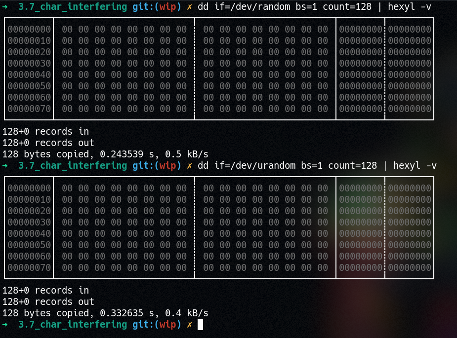

# Linux Kernel Hacking

## 3.6: Interfering with `/dev/random` and `/dev/urandom`

> There is now a blog post explaining this module in a lot more detail. Check it out [here](https://xcellerator.github.io/posts/linux_rootkits_04/)!

Both `/dev/random` and `/dev/urandom` are character devices defined in [`drivers/char/random.c`](https://github.com/torvalds/linux/blob/master/drivers/char/random.c). In particular, we care about the `random_fops` and `urandom_fops` structs which tell us which functions are to be called whenever a process tries to read/write/seek/etc the `random` and `urandom` "files".

[Line 1989](https://github.com/torvalds/linux/blob/c70672d8d316ebd46ea447effadfe57ab7a30a50/drivers/char/random.c#L1989) onwards tells us that [`random_read()`](https://github.com/torvalds/linux/blob/c70672d8d316ebd46ea447effadfe57ab7a30a50/drivers/char/random.c#L1861) and [`urandom_read()`](https://github.com/torvalds/linux/blob/c70672d8d316ebd46ea447effadfe57ab7a30a50/drivers/char/random.c#L1842) are responsible.

The function hooks only have to call the original read functions, fill a buffer with `0x00`, then copy back this buffer into userspace. All this is achieved with `copy_from_user()` and `copy_to_user()`.

To use:
* Build with `make`
* Load with `insmod rootkit.ko`
* Read some bytes from `/dev/random` with `dd if=/dev/random bs=1 count=128 | xxd`
* Read some bytes from `/dev/urandom` with `dd if=/dev/urandom bs=1 count=128 | xxd`
* Observe that both reads return nothing but `0x00`!
* Unload with `rmmod rootkit`

