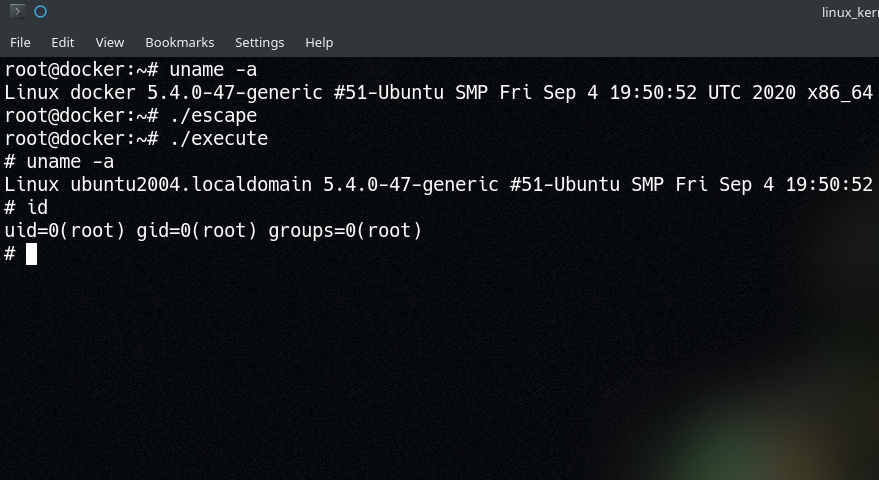

# Linux Kernel Hacking

## 3.8: Privileged Container Escapes

> Full write up [here](https://xcellerator.github.io/posts/docker_escape/)!

When privileged Linux containers attempt to load kernel modules, the modules are loaded into the host's kernel (because there is only *one* kernel, unlike VMs). This provides a route to an easy container escape.

Unlike other techniques, this module doesn't contain any syscalls hooks, but merely creates two new proc files; `/proc/escape` and `/proc/output`.

* `/proc/escape` only answers to write requests and simply executes anything that's passed to it via [`call_usermodehelper()`](https://www.kernel.org/doc/htmldocs/kernel-api/API-call-usermodehelper.html).
* `/proc/output` just takes input and stores it in a buffer when written to, then returns that buffer when it's read from - essentially acting a like a file that both the container and the host can read/write to.

The clever part is that anything we write to `/proc/escape` gets sandwiched into `/bin/sh -c <INPUT> > /proc/output`. This means that the command is run under `/bin/sh` and the output is redirected to `/proc/output`, which we can then read from within the container.

Once the module is loaded, you can simply `echo "cat /etc/passwd" > /proc/escape` and then get the result via `cat /proc/output`. Alternatively, you can use the `execute` program to give yourself a makeshift shell (albeit an extraordinarily basic one).

The only caveat is that we cannot be sure that the container has `kmod` installed (which provides `insmod` and `rmmod`). To overcome this, after building the kernel module, we load it's byte array into a C program, which then uses the `init_module()` syscall to load the module into the kernel without needing `insmod`. If you're interested, take a look at the Makefile.

To use:
* Build with `make`
* Start a privileged docker container with `docker run -it --privileged --hostname docker --mount "type=bind,src=$PWD,dst=/root" ubuntu`
* `cd /root` in the new container
* Insert the kernel module with `./escape`
* Run `./execute`!

