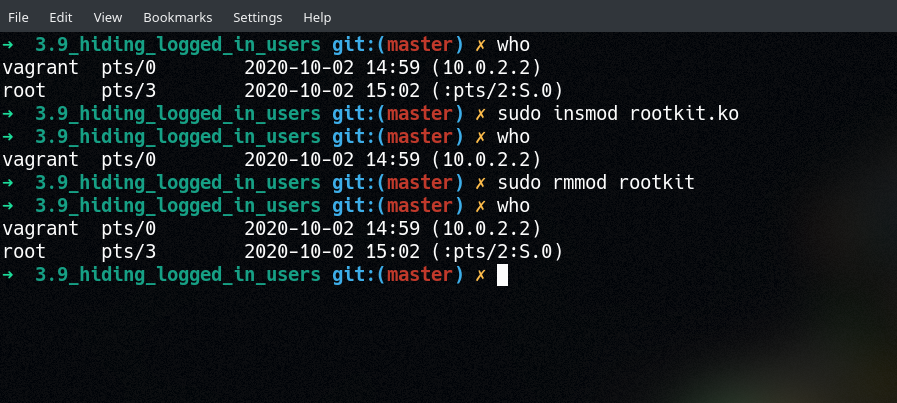

# Linux Kernel Hacking

## 3.9: Hiding Logged On Users

> A blog post is now up with much more detail on how this work! Check it out [here](https://xcellerator.github.io/posts/linux_rootkits_09/)!

In order to discover active user sessions, *most* userspace programs read the contents of `/var/run/utmp` (if you know of a program that does it another way, please let me know!). This is a binary file filled with `utmp` structs (see `man utmp`, or [`utmp.h`](./utmp.h)). By parsing this file, we can hide entries from userspace for which the `ut_user` field matches a pre-set value (in this case, `root`, but could be anything).

This works by hooking `sys_openat()` and checking each attempt to open a file for `/var/run/utmp`. If we get a match, we save the file descriptor in a global variable (`tamper_fd`). We also hook `sys_pread64()`, which is the syscall used by programs like `who` and `finger` to read the contents of binary files (like `/var/run/utmp`). In this hook, we wait for a file descriptor match with `tamper_fd`, and then check the `ut_user` field of each struct that gets read. If we find a match, then we fill the entry with `0x0` (in memory, the actual file on disk is never touched!). When the userspace program gets this empty buffer, it simply skips it and moves on the next one.

Also included in this directory is a program called `enum_utmp`. This program will read, parse and print the contents of `/var/run/utmp` more verbosely than `who` or `finger` will. In particular, it reads the entire contents of `/var/run/utmp` all at once, rather than line-by-line (which would be the "normal" way to do it). This means that we can loop through the entries ourselves manually and discover that `root` really is logged in, even when `who` and `finger` tell us it isn't.

To use:
* Build with `make`
* Load with `insmod rootkit.ko`
  * Alternatively - one may use `insmod rootkit.ko HIDDEN_USER="some_username"` where `"some_username"` is a username to be hidden. By default, it hides the "root" user.
* In another terminal, spawn a root shell via `sudo screen -S root_login`
* Back in the non-root user's terminal, run `who` or `finger` and confirm that `root` does NOT appear in the list
* Unload the module with `rmmod rootkit`
* Run `who` or `finger` again and observe that `root` now shows up!

(In the above screenshot, I have `sudo screen -S root_login` running in a separate window)
